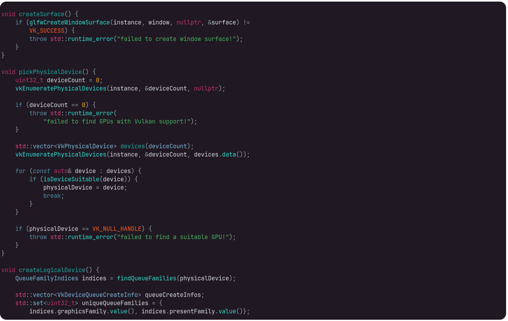

<p align="center">
    
    <h2 align="center">TZFN - Two Zero Four Nine</h2>
</p>

<p align="center">Blade Runner 2049 inspired theme for Neovim</p>

## Gallery

### Main



## Install

### [lazy.vim](https://github.com/folke/lazy.nvim)

```lua
{
    "sirzif/tzfn.nvim",
    name = "tzfn"
    config = function()
        require("tzfn").setup({
            enable = {
                terminal = true,
            },
            styles = {
                transparency = true,
            },
        })
    end,
}
```

## Options

```lua
config.options = {
    ---Set the desired variant: "auto" will follow the vim background,
    ---defaulting to `dark_variant` or "main" for dark and "light" for, well, light.
    ---@type "auto" | Variant
    variant = "auto",

    ---Set the desired dark variant when `options.variant` is set to "auto".
    ---@type Variant
    dark_variant = "main",

    ---Differentiate between active and inactive windows and panels.
    dim_inactive_windows = false,

    ---Extend background behind borders. Appearance differs based on which
    ---border characters you are using.
    extend_background_behind_borders = true,

    enable = {
        terminal = true,
    },

    styles = {
        bold = false,
        italic = true,
        transparency = false,
    },

    ---@type table<string, table<string, string>>
    palette = {},

    ---@type table<string, string | PaletteColor>
    groups = {
        border = "red",
        link = "blu2",
        panel = "surface",

        error = "err",
        hint = "cyn",
        info = "blu",
        ok = "grn",
        warn = "ylw",
        note = "blu",
        todo = "grn",

        git_add = "grn",
        git_change = "ylw",
        git_delete = "red",
        git_dirty = "mgt",
        git_ignore = "muted",
        git_merge = "grn2",
        git_rename = "grn",
        git_stage = "grn2",
        git_text = "mgt",
        git_untracked = "subtle",

        ---@type string | PaletteColor
        h1 = "red",
        h2 = "mgt",
        h3 = "cyn",
        h4 = "blu",
        h5 = "blu2",
        h6 = "muted",
    },

    ---@type table<string, Highlight>
    highlight_groups = {},

    ---Called before each highlight group, before setting the highlight.
    ---@param group string
    ---@param highlight Highlight
    ---@param palette Palette
    ---@diagnostic disable-next-line: unused-local
    before_highlight = function(group, highlight, palette) end,
}
```

## Special Thanks

[rose-pine](https://github.com/rose-pine/neovim/) - for showing da wae

[tokyonight](https://github.com/folke/tokyonight.nvim/) - for showing anotha wae
